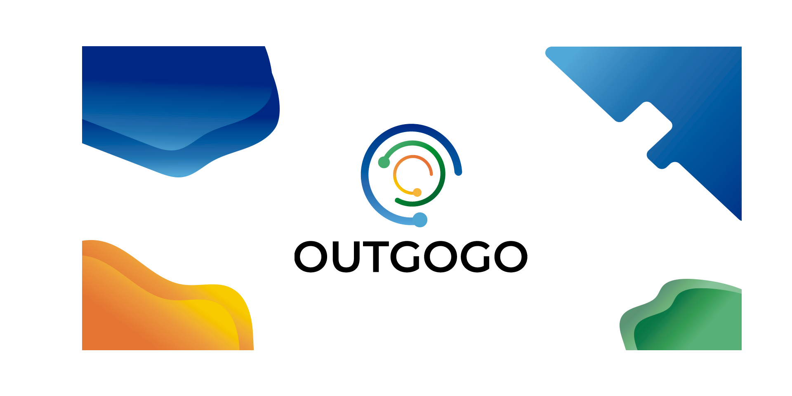

<h1 align="center">Outgogo app con Ionic</h1>
<p align="center">
    
</p>
<p>
  
  <a href="http://www.cristiangonzalez.com/portfolio/outgogo/">
    
  </a>
  <a href="https://twitter.com/cristiang">
    
  </a>
</p>

Gestiona fácilmente los gastos de tu vehículo compartido o multipropiedad.

Si utilizas el vehículo de otra persona de vez en cuando o si tu vehículo lo utiliza otra persona para sus trayectos o viajes, ya sabes que es buena idea porque es una forma de dividir los gastos propios del vehículo, pero... ¿Quién puso gasolina la última vez? ¿Quién pagó la reparación del taller? Seguro que has tenido estas discusiones alguna vez.

Con Outgogo los gastos se reparten entre los usuarios del vehículo. Cuando pones combustible, el importe se contabiliza en el recuento, igual que si pagas una reparación en el taller. Y cuando utilices el coche, debes registrar el consumo especificando la cantidad de combustible que has gastado. Así Outgogo calculará de forma automática cuánto debes o cuánto te debe cada persona.

Funciones:

- Registrar gasto: cuando pones combustible o cuando pagas el taller. En resumen, cualquier gasto que hagas para el vehículo y hayas pagado con tu dinero.

- Registrar consumo: cuando utilizas el coche (trayectos, viajes...). Debes indicar la cantidad de combustible que has gastado.

- Registrar pago: cuando pagas a otro usuario del vehículo por las deudas acumuladas, registra el pago para que Outgogo lo tenga en cuenta para mostrar el balance.

### 🏠 [Homepage](http://www.cristiangonzalez.com/portfolio/outgogo/)

## Install

```sh
npm install
```

## Usage

```sh
ionic cordova run android
```

## Author

👤 **Cristian González**

* Twitter: [@cristiang](https://twitter.com/cristiang)
* Github: [@cristian-g](https://github.com/cristian-g)

## 🤝 Contributing

Contributions, issues and feature requests are welcome!<br />Feel free to check [issues page](https://github.com/cristian-g/outgogo-app/issues).

## Show your support

Give a ⭐️ if this project helped you!
